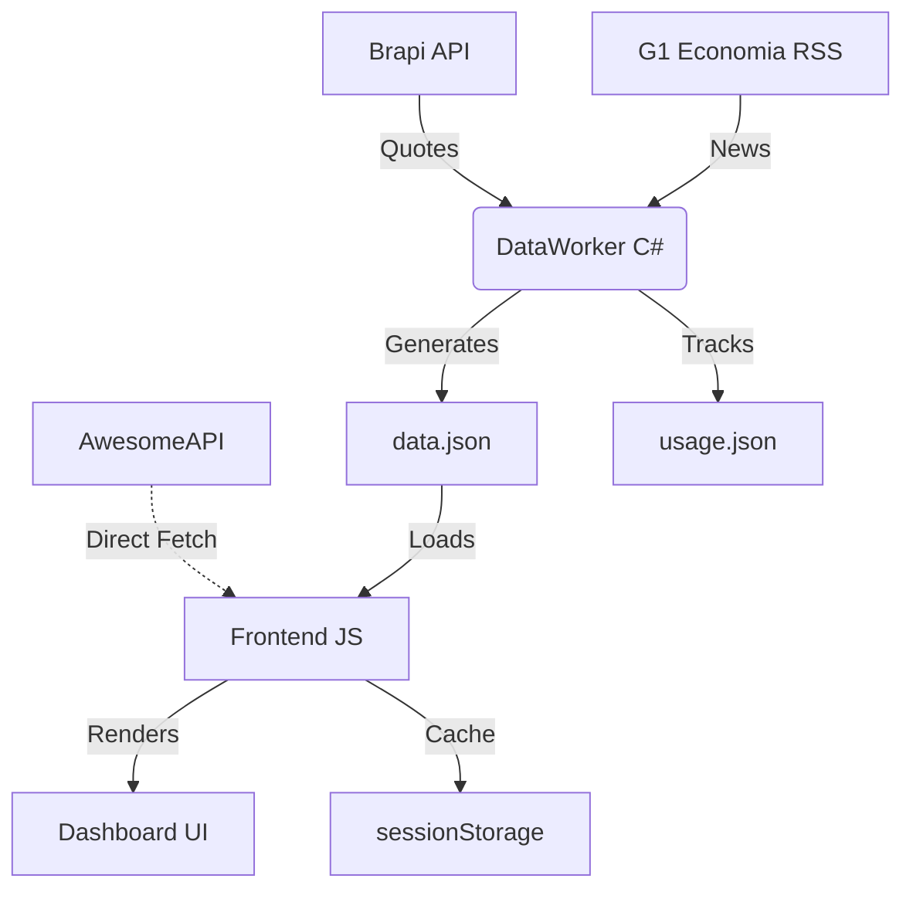

# MarketHub: Documentação Técnica de Arquitetura e Código

O MarketHub é um terminal financeiro híbrido composto por um processador de dados em segundo plano (**DataWorker**) e uma interface de apresentação leve (**Frontend**). Esta documentação detalha a implementação técnica de ambos os componentes.

---

## 🏗️ Visão Geral da Arquitetura

O sistema opera em um modelo de **Pré-Processamento de Dados**. Em vez de o cliente lidar com a complexidade de múltiplas APIs e normalização, um robô em C# prepara um estado consolidado da aplicação.



---

## ⚙️ Backend: DataWorker (C# / .NET 9.0)

Localizado em `MarketHub.Worker/Program.cs`, este componente é responsável pela integridade dos dados e controle de custos (cotas).

### 1. Sistema de Monitoramento de Cotas (`usage.json`)
O Worker carrega e persiste o uso mensal de requisições. 
- **Lógica**: Se o mês mudou, o contador é resetado. Se o limite (15.000) for atingido, o Worker aborta a execução para evitar custos ou bloqueios de API.

### 2. Agregação e Limpeza de Dados
- **Brapi API**: Busca cotações individuais para uma lista pré-definida de ativos B3.
- **RSS Parser (G1)**: Implementa uma limpeza agressiva de XML para lidar com Byte Order Marks (BOM) e caracteres especiais que impedem o `XmlDocument.LoadXml` padrão.
- **Normalização**: Formata as variações percentuais (`changeStr`) e garante que valores nulos sejam tratados como `0`.

### 3. Estrutura do `data.json`
O arquivo resultante é a "fonte da verdade" do frontend:
```json
{
  "slider": [ { "symbol": "...", "price": 0.0, "changeStr": "+0,00%" } ],
  "news": [ { "title": "...", "url": "...", "source": "..." } ]
}
```

---

## 🌐 Frontend: Vanilla Web (JS/CSS)

A interface é projetada para ser ultra-rápida, sem dependências de frameworks (React/Vue).

### 1. Gerenciamento de Estado e Inicialização (`app.js`)
- **`init()`**: Dispara o relógio, verifica o status da B3 e carrega os dados iniciais.
- **Cache de Sessão**: Implementa um wrapper em torno do `sessionStorage` para armazenar o histórico de preços de cada ativo consultado, reduzindo em até 80% o consumo de API em navegações recorrentes.

### 2. Integração com AwesomeAPI (Dólar)
O Dólar Comercial é tratado como uma exceção técnica. O `app.js` detecta o ticker `USD-BRL` e redireciona a requisição para os endpoints da AwesomeAPI, permitindo dados gratuitos e ilimitados para câmbio.

### 3. Visualização com Chart.js
- **Configuração**: Utiliza escalas lineares, gradientes de fundo e interações de hover customizadas.
- **Padrão Brasileiro**: Os valores nos eixos e tooltips são formatados via `Intl.NumberFormat` (pt-BR).

---

## 🎨 Sistema de Design (CSS)

O `style.css` utiliza variáveis CSS para manter a consistência do tema **Dark Mode** e **Glassmorphism**.

### 1. Variáveis de Cor
- `--primary`: Azul vibrante (#0071e3).
- `--card-bg`: Fundo translúcido (rgba(25, 25, 27, 0.8)).

### 2. Ticker-Tape (Animação Nativa)
O letreiro no topo funciona via CSS puro:
```css
@keyframes ticker {
    0% { transform: translateX(0); }
    100% { transform: translateX(-100%); }
}
```
Isso garante que a animação não consuma ciclos de CPU da Thread principal do JavaScript, mantendo os gráficos fluidos mesmo durante o movimento do letreiro.

---

## 🛠️ Manutenção e Fluxo de Trabalho

1. **Atualização de Dados**: Execute `dotnet run` na pasta do Worker.
2. **Adição de Ativos**: Adicione o ticker no array de `tickers` no `Program.cs` e o nome amigável no objeto `ASSET_NAMES` no `app.js`.
3. **Deploy**: Envie os arquivos atualizados para o repositório. O `data.json` deve estar presente para que o Slider e as Notícias funcionem.

---
*Documentação técnica oficial - MarketHub Financial Dashboard.*
